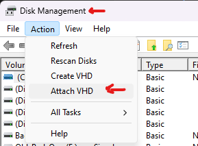
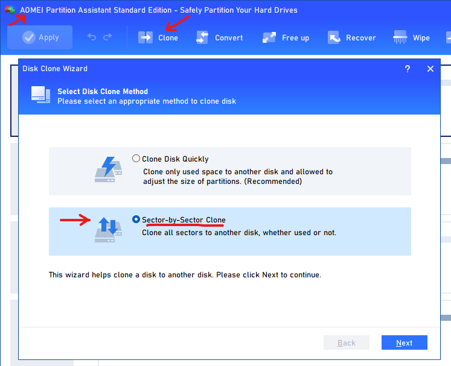

# WebNode
It is a Vagrant and Ansible Playbook that builds a local host with Apache2, MariaDB, PHP, Wordpress and Postfix Relay Roles.

## Copy VMHDK to Physical Disk
VirtualBox VMHDK disk images can be converted into Physical Disk images. General Process is as follows:  
1. Convert VMHDK to VDI Image.
  
  VBoxManage clonehd source.vmdk target.vhd --format vhd
  
2. On Windows 10/ Windows 11, mount VDI image file as a Disk using Windows Disk Management tool.
  
  

3. Using a free/good Disk cloning software make a clone of the mounted Disk Image from Step 2 above to target Disk (Note: All data on target disk will be erased).
  
  

4. Place the Target disk in an actual AMD64/x86_64 computer, remove all other disks for protection of those disks.
5. Also place a Debian12/Ubuntu/RockyLinux8 Installation media in the same target computer.
6. Boot from the Installtion media and go to Rescue Mode. Mount the Target disk from Step 4 above, Also mount its boot partition. Then using the rescue Media, install/re-install GRUB boot Loader on that disk. Then Shutdown/Reboot. Remove the Installation Media.
7. Once the computer successfully boots from the Target Disk, you can login using vmuser1, vmuser2 or Vagrant (If account was not removed earlier) credentials.
8. Check Network connectivity. You may need to add Network Drivers available in the webNode VMHDK image. Try adding the following (public network) to the Vagrantfile. This will add a Bidged Network Controller in the VirtualBox VM. This should enable Physical Network Card Drivers in the VM Image on disk.
```
  config.vm.define "debian" do |debian|
    debian.vm.box = "raufhammad/debian12"
    debian.vm.network "private_network", ip: "192.168.56.6"
    debian.vm.network "public_network"
  end 
```
9. Short-Commings
  * Only MBR Disk Image is created, supporting Old BIOS. No GPT Disk Image, No UEFI BIOS.
  * Smaller sized disks images only, less then 1 TB.

## Local Images Creation - On VirtualBox
It can be used in Windows 10/11 (a bit difficult to setup), or you can use Debian/Ubuntu host environemnt.
1. Install VirtualBox
2. Install Vagrant, Ansible (Use Windows Subsystem for Linux 2)
3. Install some plugins in WSL2 to allow Ansible and Vagrant to access Windows VirtualBox (Google Search).
4. Change into the project root folder.
5. Run:
    ```
    vagrant up
    ```
6. To Destroy run:
    ```
    vagrant destroy -f
    ```

## Cloud Image Creation - On Linode
It can be used in Windows 10/11 (a bit difficult to setup), or you can use Debian/Ubuntu host environemnt.
1. Install Ansible, Terraform (Use Windows Subsystem for Linux 2)
2. Install some plugins in WSL2 for Ansible (Google Search)
3. Change into the project root folder.
4. Change into "tf-linode" subfolder
5. Run:
    ```
    terraform init
    terraform plan
    terraform apply -auto-approve
    ```
6. To Destroy run:
    ```
    terraform destroy -auto-approve
    ```
  


