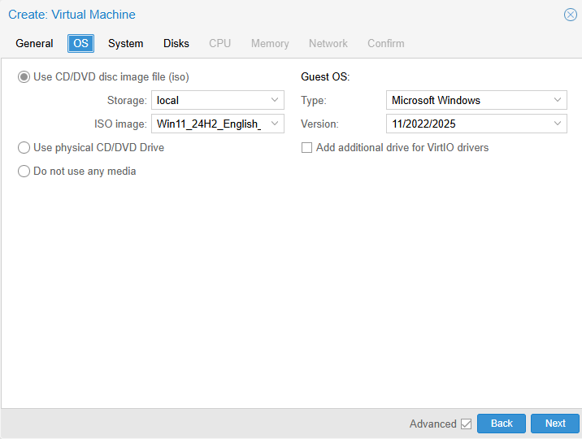
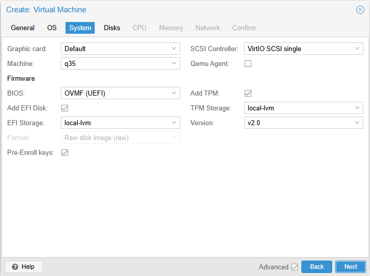
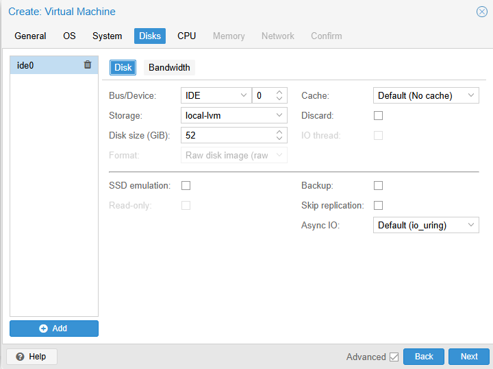
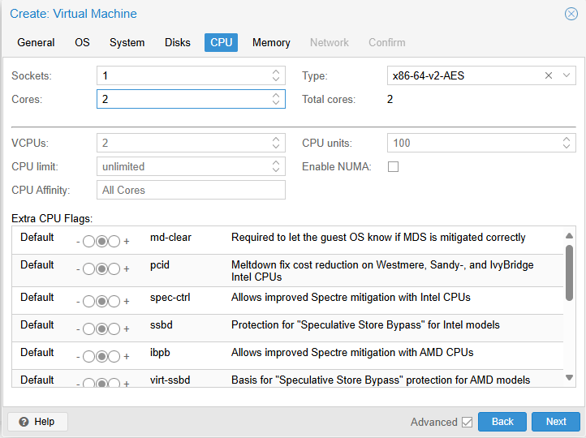
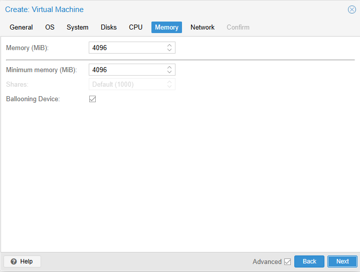
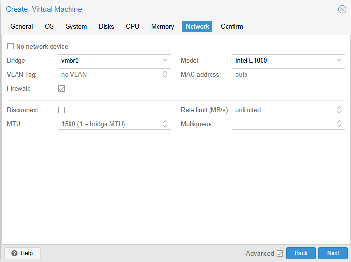

# Win11Pro - Template - Notes
Proxmox can store KVM VM images and LXC VM Images (CT templates) as template for quick deployment. LXC VMs share kernel with the Proxmox host, so only Linux is a possibility.

## Win11Pro - Minimum Requirements
- Disk size - 52GB
- RAM - 4 GB
- TPM - true
- Cores - Minimum 2 cores - 1 GHz or faster.


## Win11Pro - Sysprep
[Refernce 1 - https://learn.microsoft.com/en-us/windows-hardware/manufacture/desktop/sysprep--generalize--a-windows-installation?view=windows-11](https://learn.microsoft.com/en-us/windows-hardware/manufacture/desktop/sysprep--generalize--a-windows-installation?view=windows-11)  
[Reference 2 - https://learn.microsoft.com/en-us/windows-hardware/manufacture/desktop/boot-windows-to-audit-mode-or-oobe?view=windows-11](https://learn.microsoft.com/en-us/windows-hardware/manufacture/desktop/boot-windows-to-audit-mode-or-oobe?view=windows-11)  
```cmd
%WINDIR%\system32\sysprep\sysprep.exe /generalize /shutdown /oobe
```
  
## Win11Pro - Create local user account
[Reference 3 - https://www.youtube.com/watch?v=62w1rKxOZMs&t](https://www.youtube.com/watch?v=62w1rKxOZMs&t)  
[Reference 4 - https://answers.microsoft.com/en-us/windows/forum/all/how-to-create-a-local-account-in-windows-11/24c2e160-ac65-4748-a733-529e6507dfdf](https://answers.microsoft.com/en-us/windows/forum/all/how-to-create-a-local-account-in-windows-11/24c2e160-ac65-4748-a733-529e6507dfdf)  


## Win11pro Manual Creation - Screen Shots
  Win11Pro Manual Creation - 1. OS  
  Win11Pro Manual Creation - 2. System  
  Win11Pro Manual Creation - 3. Disk  
  Win11Pro Manual Creation - 4. CPU  
  Win11Pro Manual Creation - 5. Memory  
  Win11Pro Manual Creation - 6. Network  
