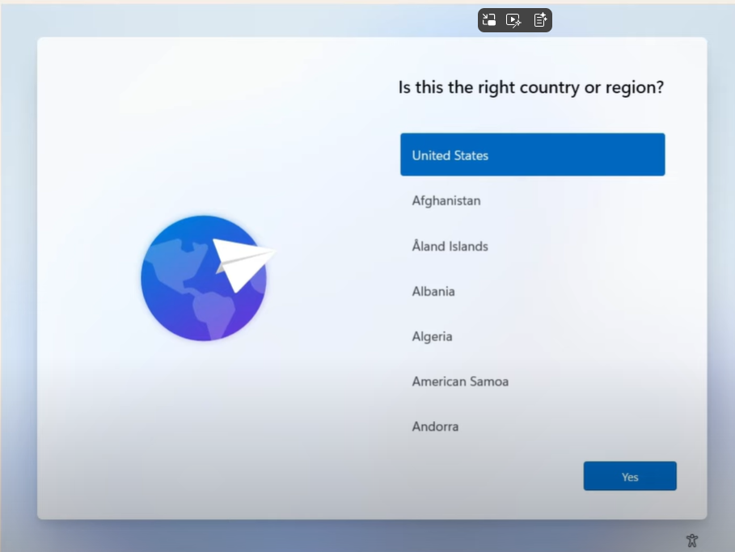
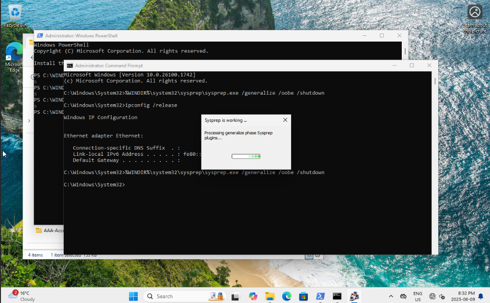
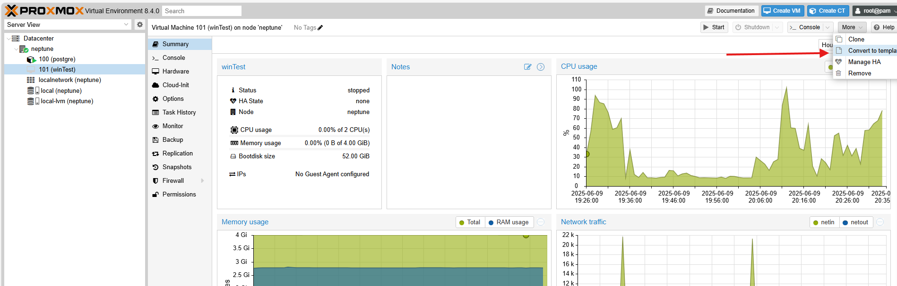

# Win11Pro - Template - Notes
Proxmox can store KVM VM images and LXC VM Images (CT templates) as template for quick deployment. LXC VMs share kernel with the Proxmox host, so only Linux is a possibility.

## Win11Pro - Minimum Requirements
- Disk size - 52GB
- RAM - 4 GB
- TPM - true
- Cores - Minimum 2 cores - 1 GHz or faster.


## Win11Pro - Sysprep
[Refernce 1 - https://learn.microsoft.com/en-us/windows-hardware/manufacture/desktop/sysprep--generalize--a-windows-installation?view=windows-11](https://learn.microsoft.com/en-us/windows-hardware/manufacture/desktop/sysprep--generalize--a-windows-installation?view=windows-11)  
[Reference 2 - https://learn.microsoft.com/en-us/windows-hardware/manufacture/desktop/boot-windows-to-audit-mode-or-oobe?view=windows-11](https://learn.microsoft.com/en-us/windows-hardware/manufacture/desktop/boot-windows-to-audit-mode-or-oobe?view=windows-11)  
```cmd
%WINDIR%\system32\sysprep\sysprep.exe /generalize /oobe /shutdown
```
  
## Win11Pro - Create local user account
[Reference 3 - https://www.youtube.com/watch?v=62w1rKxOZMs&t](https://www.youtube.com/watch?v=62w1rKxOZMs&t)  
[Reference 4 - https://answers.microsoft.com/en-us/windows/forum/all/how-to-create-a-local-account-in-windows-11/24c2e160-ac65-4748-a733-529e6507dfdf](https://answers.microsoft.com/en-us/windows/forum/all/how-to-create-a-local-account-in-windows-11/24c2e160-ac65-4748-a733-529e6507dfdf)  
[Refernce 5 - read://https_pureinfotech.com/?url=https%3A%2F%2Fpureinfotech.com%2Fbypass-microsoft-account-setup-windows-11%2F](read://https_pureinfotech.com/?url=https%3A%2F%2Fpureinfotech.com%2Fbypass-microsoft-account-setup-windows-11%2F)  

## Win11pro Manual Creation - Screen Shots
Win11Pro Manual Creation - 1. OS  

  
Win11Pro Manual Creation - 2. System  

  
Win11Pro Manual Creation - 3. Disk  

  
Win11Pro Manual Creation - 4. CPU  

  
Win11Pro Manual Creation - 5. Memory  

  
Win11Pro Manual Creation - 6. Network  

  
## sysPrep Steps - Convert Win11Pro KVM VM to Template on Proxmox
1. Start the KVM VM and install the OS from Windows Installation ISO.
1. On Country selection Screen, press SHIFT+F10, A Command Prompt opens.
  
    
    On Country selection Screen, press SHIFT+F10
    ```CMD
    oobe\bypassnro
    ```
    System Auto Reboots
1. Again on Country selection Screen, press SHIFT+F10, A Command Prompt opens.
    ```CMD
    ipconfig /release
    ```
    Complete setup with local account. Choose "I don't have internet" when prompted (without "oobe\bypassnro" and "ipconfig /release", this option does not appear).
1. Reboot (This will enable Internet).  
  
<< STOP HERE, If You Only want to make a local admin User account. Continue for SYSPREP. >>
  
1. Turn On, then Turn off Bit Locker Drive Encryption on OS Drive. Give it time to decrypt.
    Open Admin CMD:
    ```CMD
    %WINDIR%\system32\sysprep\sysprep.exe /generalize /oobe /shutdown
    ```
1. If APP Removal errors in sysprep log file, then Open PowerShell Admin Prompt and Type the following for all erroring Apps.:
    ```Powershell
    Remove-AppxPackage -Package Microsoft.WidgetsPlatformRuntime_1.6.1.0_x64__8wekyb3d8bbwe -allusers
    ```
1. Then Disable Networking again from Admin CMD:
    ```
    ipconfig /release
    ```
1. Repeat - Open PowerShell Admin Prompt and Type the following for all erroring Apps.:
    ```
    Remove-AppxPackage -Package Microsoft.WidgetsPlatformRuntime_1.6.1.0_x64__8wekyb3d8bbwe -allusers
    ```
1. Then sysprep.exe command should work, in Admin CMD prompt:
    ```
    %WINDIR%\system32\sysprep\sysprep.exe /generalize /oobe /shutdown
    ```
    
    After successfull completion of Sysprep execution, your computer should be in off state.
1. In Proxmox web console, convert the stopped KVM VM to Template.
    
  
## Normal method of adding Local User Account
Note: This method is not used for Promox Sysprep (Noted here for completness only).
On an Admin CMD Prompt: 

    ```CMD
    net user uname “password@123″ /ADD /FULLNAME:”Full User Name” /comment:”server support enginer” /LOGONPASSWORDCHG:yes
    net localgroup administrators uname /add
    net localgroup "Remote Desktop Users" uname  /add
    ```
  
